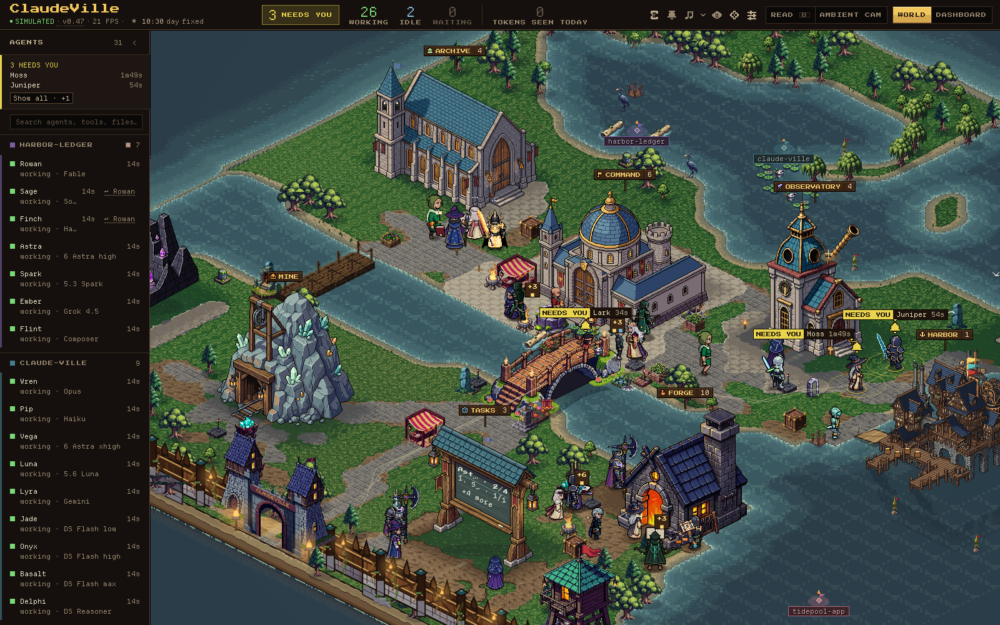
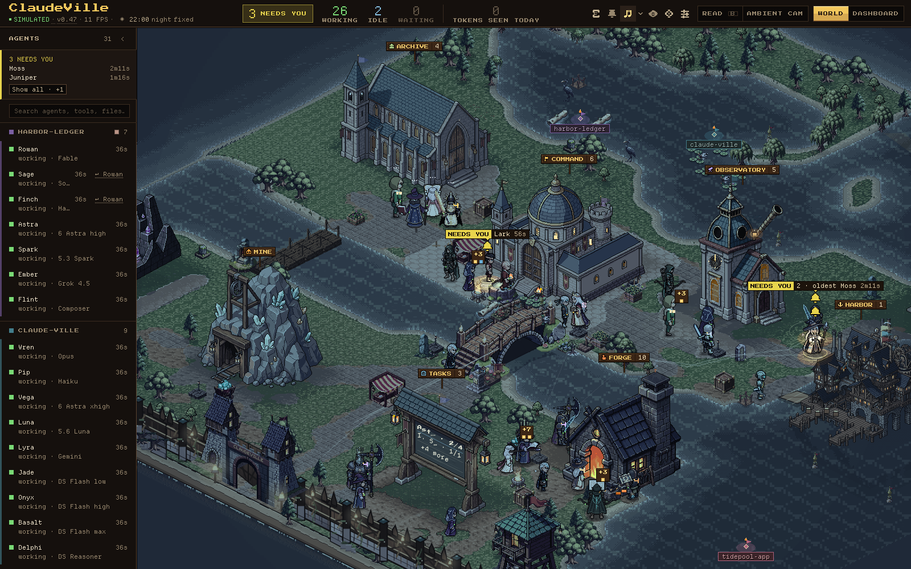
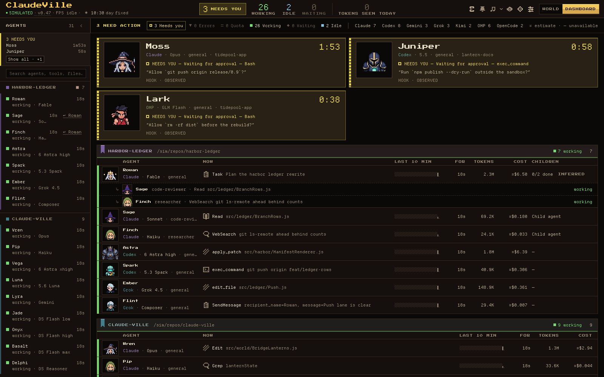
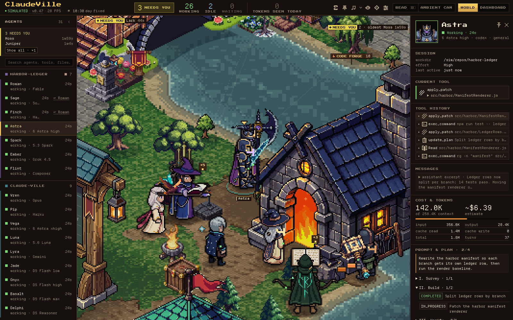
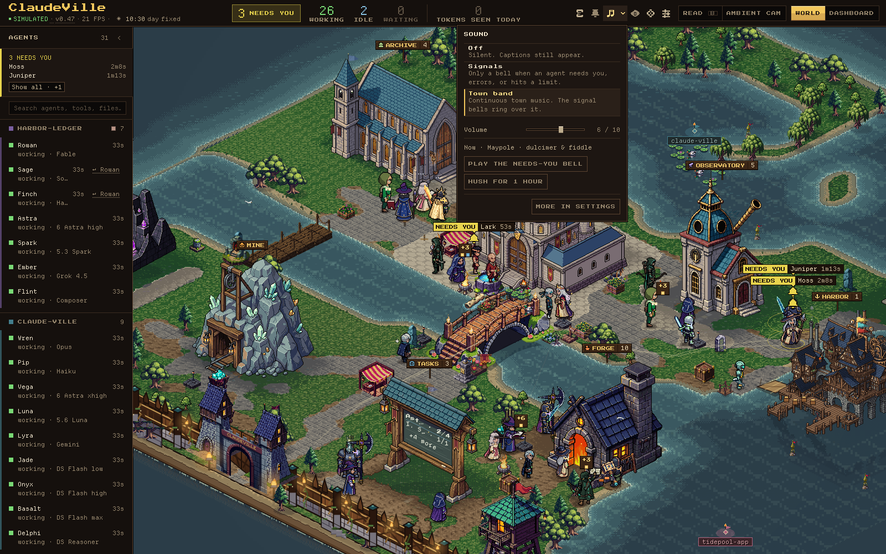

# ClaudeVille

[](./CHANGELOG.md)
[](https://github.com/TokenBrice/claude-ville/actions/workflows/ci.yml)
[](./LICENSE)
[](./package.json)
[](#quick-start)
[](#local-and-read-only)
[](#supported-providers)

Watch your local AI coding CLIs work in a living pixel village.

ClaudeVille is a local-first dashboard for Claude Code, OpenAI Codex CLI, Google Gemini CLI, xAI Grok CLI, Kimi, OpenCode, and OMP (Oh My Pi) sessions. It reads provider logs read-only, normalizes them into one session model, and shows every active agent either as a villager in an isometric pixel island or as a row in a dense monitoring dashboard. Agents that need you, errored, or hit a rate limit are the loudest thing on screen.



- **Local and read-only:** no hosted service, no telemetry, no provider-file writes.
- **Seven providers:** Claude Code, Codex CLI, Gemini CLI, Grok CLI, Kimi, OpenCode, and OMP.
- **Two views:** World mode for second-monitor awareness; Dashboard mode for exact state.
- **Attention first:** one plate per agent that needs you, errored, or is rate-limited; `A` frames them all; the top bar and sidebar count them.
- **Sound, off by default:** *Signals* rings a bell only when an agent needs you, errors, or hits a limit; *Town band* adds a 19-piece songbook. `M` toggles.
- **Zero-build runtime:** a dependency-free Node HTTP/WebSocket server plus static browser ES modules.

Release history and user-facing changes: [CHANGELOG.md](./CHANGELOG.md), also shown in-app from the version chip.

`TokenBrice/claude-ville` is a public fork of `honorstudio/claude-ville` and is the maintained branch for multi-provider ClaudeVille.

## Screenshots

| World mode at night | Dashboard mode |
| --- | --- |
|  |  |

| Activity panel | Sound popover |
| --- | --- |
|  |  |

Screenshots use the built-in simulator (`?sim=1`), not real sessions.

## Features

### World mode

An isometric pixel island where each session is a villager whose sprite follows its model family and reasoning effort. Agents walk to the building that matches their current work. Buildings (source of truth: [`claudeville/src/config/buildings.js`](./claudeville/src/config/buildings.js)):

| Building | Draws |
| --- | --- |
| Command Center | Team status; opens a sectional interior when selected at zoom 2 or closer, listing the real assigned sessions as seats with an exact `+N more`. |
| Task Board | The selected (or pinned, or most recently changed) agent's checklist in chalk, grouped by phase, with project-coloured plan tabs. |
| Code Forge | Code work: workload billets and a result shelf that stamps only provider-reported exit codes. |
| Token Mine | Token usage: an assay bench with exact input and cache-read counts for the last minute. |
| Grand Lore Archive | Reading and search. |
| Research Observatory | External research. |
| Portal Gate | Browser and remote tools. |
| Pharos Lighthouse | Sea watch and beacon. |
| Harbor Master | Unpushed commits as ships moored per repository, push departures, a crown for a verified release, and a broken bracket for a failed push. |

- **Signal layer.** One attention plate per waiting, errored, or rate-limited agent, grouped by kind and docked at the frame edge when the agent is off-screen. District plaques state the exact count of agents routed there (`FORGE │ 8`).
- **Instruments.** Hold **B** (or READ) to swap routine names for work verbs. **A** frames every agent needing attention and states how many fell outside the frame. The World dock's **FREE | AUTO | AMBIENT** control says who moves the camera: only you, the automatic camera while you are idle, or a patient broadcast of the busiest real work that any camera input or selection hands back. **F** frames the village; `/` or `Ctrl/Cmd+K` searches agents.
- **Light and weather.** One colour grade from the local clock, a seeded daily weather timeline, the moon phase, and the season. After dusk, windows light only where someone works. Weather is modelled locally, never fetched.
- **Moments.** Arrivals rise as a violet column at the gate, sub-agents fly out as comets and land near their parent, and a finished top-level agent walks out through the gate while a finished sub-agent merges back into its parent.
- **Renderer.** A resident GPU world by default on a hardware GPU: WebGPU in Chrome and other Chromium browsers, WebGL2 in Safari and Firefox (and wherever WebGPU cannot start; both draw the same picture). The World falls back to Canvas 2D on a software rasterizer (SwiftShader, llvmpipe) or with `?renderer=canvas`; `?renderer=webgl` forces WebGL2 and `?renderer=webgpu` forces WebGPU (Safari's opt-in). On an HDR screen the WebGPU world lets lit windows, lamps and action-needed marks glow above paper white (Settings → *HDR highlights*: Off, Subtle by default, or Full; every other pixel and every SDR screen keeps the standard picture), and on a Display P3 screen either GPU world draws the reserved status and lamp colours in the wider gamut. Shift-D shows the debug overlay, whose first row names the World backend and why it was chosen.

### Dashboard mode

DOM rows grouped by project, for exact state without the world:

- A bell lane at the top turns every agent that needs you, errored, or is rate-limited into a call card with portrait, blocker, redacted prompt, live elapsed clock, and provenance.
- One header row per project: `AGENT / NOW / LAST 10 MIN / FOR / TOKENS / COST`, plus `WORKING SET` and `CHILDREN` when a row has data. `LAST 10 MIN` is a tape of tool calls this tab observed.
- Clicking a row expands its detail inline (tool history, recent messages, model identity); detail is polled only while Dashboard mode is active.

### Shared chrome

- **Top bar:** connection state, version chip (opens the changelog), FPS, the village clock, working/idle/waiting counts, one lit slot for `NEEDS YOU` / `ERROR` / `LIMIT`, and `TOKENS SEEN TODAY`, which opens a spend map by project and provider (5-minute burn rate, today's observed totals, estimated pricing).
- **Sidebar:** project-grouped agent list, an exception shelf for agents that need you, errored, or hit a quota limit, and the Harbor ledger of unpushed commits per repository and branch.
- **Activity Panel:** a character sheet for the selected agent: session, cost and tokens, current tool, tool history, messages, prompt and plan, working set with overlap warnings, and a causal waterfall of the last 20 minutes that SCORE can draw over the village.
- **Village Chronicle:** a day ledger of arrivals, departures, waits, errors, commits, and pushes, stored in the browser's IndexedDB.
- **Settings and health:** sound options, controls (automatic camera, desktop alerts, collapsed sidebar, reduced motion, HDR highlights), provider watchtower roster, storage ledger, pricing revision, and frame-time health.
- **Desktop alerts:** optional browser notifications.

### Sound

Off by default. The SOUND control in the top bar opens a popover with three presets:

| Preset | What you hear |
| --- | --- |
| Off | Nothing. Captions can still describe signals. |
| Signals | Silence until an agent needs you (ship's bell), errors (cracked bell), or hits a rate limit (escapement tick). An unanswered wait repeats on a capped reminder ladder. |
| Town band | The Isle Band plays a 19-piece songbook (11 day, 8 night) in shuffled order, re-dressed for rain and snow; every Signals bell still rings over it. |

`M` toggles sound anywhere. The popover also shows the tune now playing, a volume per preset, a needs-you test bell, `HUSH FOR 1 HOUR`, and a link to Settings (output, tone, quiet hours, captions, *Soften sudden sounds*).

## Local And Read-Only

ClaudeVille binds only to the IPv4 loopback interface at `localhost:4000` and reads supported CLI session stores from your machine. It does not write provider session files, does not proxy requests to a hosted service, and does not need a build step to run. To place commits in the harbor it runs read-only `git` queries against active projects and against GitHub checkouts under `~/Documents/git` (override with `CLAUDEVILLE_REPOSITORY_SCAN_ROOT`).

Browser state (settings, the Chronicle, the spend ledger) stays in that browser's `localStorage` and IndexedDB.

## Supported Providers

| Provider | Local source |
| --- | --- |
| Claude Code | `~/.claude/` |
| Codex CLI | `~/.codex/sessions/` |
| Gemini CLI | `~/.gemini/tmp/` |
| Grok CLI | `~/.grok/sessions/` |
| Kimi | `~/.kimi/` and `~/.kimi-code/` |
| OpenCode | `~/.local/share/opencode/opencode.db` |
| OMP (Oh My Pi) | `~/.omp/agent/sessions/` |

Model families served through another provider keep their own identity: DeepSeek through OpenCode, z.AI GLM and DeepSeek through OMP. Pricing, context windows, labels, and sprites come from one registry, [`claudeville/src/config/models.json`](./claudeville/src/config/models.json).

## Quick Start

```bash
npm run dev
```

Open `http://localhost:4000`. With no live sessions, `http://localhost:4000/?sim=1` runs the built-in agent simulator.

The runtime needs no install: `npm run dev` uses only Node built-ins and static browser files. Validation and asset scripts use dev dependencies; install them with `npm ci`, and add Playwright's Chromium (`npx playwright install chromium`) for browser-driven scripts such as `verify:render` and `audio:probe`.

## Requirements

- Node.js 22.7 or newer. The browser modules are `.js` ES modules, and Node detects that syntax unflagged only from 22.7, so the checks and tests need it. CI runs Node 22 and 24.
- A desktop browser at 1280px wide or larger. Mobile and narrow viewports are out of scope.
- At least one provider store from [Supported Providers](#supported-providers). Kimi reads legacy sessions from `~/.kimi/sessions/` and Kimi Code sessions from `~/.kimi-code/sessions/`. OpenCode needs Node's `node:sqlite` or the `sqlite3` CLI for read-only database access.

Empty provider lists are normal on machines where no supported CLI has local session files yet.

## Project Layout

```text
claude-ville/
|-- claudeville/
|   |-- server.js              # Node HTTP server, hand-written WebSocket, file watchers
|   |-- index.html             # Browser entrypoint
|   |-- adapters/              # Provider parsers (claude, codex, gemini, grok, kimi, opencode, omp),
|   |                          #   registry (index.js), turn state, git events, hook overlay, tool results
|   |-- services/              # Usage/quota, session residency, working-set collisions
|   |-- assets/                # Sprite manifest, palettes, PNGs, atlases, fonts
|   |-- css/                   # Static CSS; dashboard, panel, and modal sheets load on first use
|   |-- vendor/                # Vendored js-yaml
|   |-- tools/                 # Dev pages (model-roster.html)
|   `-- src/
|       |-- config/            # Buildings, town plan, theme, i18n, model registry (models.json + generated)
|       |-- domain/            # World, agents, buildings, events, value objects, domain services
|       |-- application/       # AgentManager, attention, chronicle, spend ledger, mood, session watcher
|       |-- infrastructure/    # REST data source, WebSocket client, IndexedDB chronicle store
|       `-- presentation/
|           |-- App.js         # Boot orchestration
|           |-- character-mode/ # World mode: renderer, camera, sprites, gpu/, postfx/
|           |-- dashboard-mode/ # Dashboard mode
|           `-- shared/        # Top bar, sidebar, Activity Panel, settings, chronicle, audio/
|-- scripts/
|   |-- tests/                 # node:test unit suites; integration/ holds the replay suite
|   |-- smoke/                 # Render, server, architecture, and performance smokes
|   |-- audio/                 # Offline listening harness and audio probe
|   |-- sprites/               # Manifest validation, generation, atlases, visual diff
|   |-- world/                 # Building/terrain validators, render baselines
|   |-- models/                # Model registry generator and resolver
|   |-- release/               # Changelog validation and version bump
|   |-- adapters/              # Adapter fixtures and their validator
|   |-- agent-hooks/           # Claude Code hook helper
|   `-- agents/                # Retained-artifact index check
|-- docs/                      # Contracts, runbooks, troubleshooting; assets/github/ screenshots
|-- agents/                    # Retained plans and research (see agents/README.md)
|-- .claude/                   # Claude Code skills and hooks
|-- .github/workflows/ci.yml   # npm ci + validate:full on Node 22 and 24
`-- package.json
```

## Runtime Architecture

`claudeville/server.js` binds to `127.0.0.1:4000`, serves static files from `claudeville/` (gzip for JSON, JavaScript, and CSS; strong SHA-256 ETags), exposes same-origin JSON API endpoints, and upgrades WebSocket clients at `ws://localhost:4000/ws`. File watchers mark the affected provider dirty; a bounded 2-second probe re-checks active transcripts and project git state and broadcasts while WebSocket clients are connected, and a 30-second reconciliation refreshes the watch topology. Clients receive an initial snapshot, then deltas with a full snapshot every 20 seconds.

The frontend boot path is `claudeville/src/presentation/App.js`:

1. Domain: create `World` and add `BUILDING_DEFS` buildings.
2. Infrastructure: `ClaudeDataSource`, `WebSocketClient`, and the IndexedDB `ChronicleStore`.
3. Shared UI: `Toast`, `Modal`, `AttentionService`, `ChronicleLog`, `SpendLedger`, `TopBar`, `Sidebar`.
4. Application services: `AgentManager` (with its departure sweep), `ModeManager`, `NotificationService`, `MoodService`.
5. In parallel: sprite metadata, the `IsometricRenderer` module, the `DashboardRenderer` module, and the initial snapshot over the WebSocket (REST is the fallback).
6. Start `SessionWatcher` (skipped under `?sim=1`, which starts the simulator instead).
7. Bind the World container `ResizeObserver`.
8. Mount `IsometricRenderer` once assets and module are ready: WebGPU in a Chromium browser whose adapter, device and pipelines resolved (they start resolving beside the asset fetch; a cold shader cache mounts WebGL2 and switches to WebGPU once compiled), else resident WebGL2 on a hardware rasterizer, unless `?renderer=` or `?postfx=0` says otherwise (Canvas on a software rasterizer unless `?renderer=webgl`); the canvases fade in on the first presented frame.
9. Bind agent follow and `#agent=<id>` deep links. The Activity Panel and Chronicle panel load with their stylesheets on first use; audio loads after boot.
10. Apply English UI strings.

The layout is a full-height flex shell: a 48px top bar, a collapsible left sidebar, the central content area, and an optional 320px right Activity Panel. World mode fills the content area with a three-canvas stack; Dashboard mode scrolls vertically.

## Local Server API

The server is hardcoded to port `4000` and the IPv4 loopback interface. Requests with a non-local `Host` or a cross-origin browser `Origin` are rejected; origin-less local CLI requests remain supported.

| Endpoint | Description |
| --- | --- |
| `GET /api/sessions` | Active sessions from all available providers, with a shared git-event table and scan state. `force=1`, `force=true`, or `force=yes` bypasses the session-list cache. |
| `GET /api/session-detail?sessionId=&project=&provider=` | Tool history, recent messages, and token usage where available. |
| `POST /api/session-details` | Batch detail fetch. Body: `{ "items": [{ "key", "sessionId", "project", "provider" }] }`; max 256 KiB, first 100 items, invalid providers skipped; `count` is the number of returned detail payloads. |
| `POST /api/ingest/hook` | Opt-in lifecycle events from local CLI hooks (loopback, in memory, expiring). Set `CLAUDEVILLE_INGEST_TOKEN` to require a matching `X-ClaudeVille-Ingest-Token` header. Hook stanzas: [docs/troubleshooting.md](./docs/troubleshooting.md#permission-prompts-are-inferred-or-arrive-late). |
| `GET /api/teams` | Claude Code team metadata from `~/.claude/teams/`. |
| `GET /api/tasks` | Claude Code task groups from `~/.claude/tasks/`. Diagnostic; the UI does not fetch it. |
| `GET /api/providers` | Detected providers, home directories, and per-provider health. |
| `GET /api/usage` | Usage, subscription, activity, and quota metadata. |
| `GET /api/perf` | Runtime counters: watchers, caches, adapter scan cost, event loop, memory. |
| `GET /api/changelog` | Raw `CHANGELOG.md` text for the in-app changelog modal. |
| `ws://localhost:4000/ws` | Same-origin snapshot, delta updates, and ping/pong heartbeats. |

The server does not enable CORS and rejects `OPTIONS` requests. Missing or invalid routes receive JSON error responses.

## Provider Adapters

Adapters live in `claudeville/adapters/` and are registered in `adapters/index.js`. Each adapter reports whether its local provider directory exists, returns active sessions, returns detail for one session, and provides watch paths for live updates.

| Provider | Session source | Notes |
| --- | --- | --- |
| Claude Code | `~/.claude/`: `history.jsonl`, `projects/*/*.jsonl`, subagent and workflow-subagent files, teams, tasks | Main sessions, subagents, team members, token usage, provider-reported cost, prompts, todos, git branch, permission mode, and git commit/push extraction. |
| Codex CLI | `~/.codex/sessions/YYYY/MM/DD/rollout-*.jsonl` plus `session_index.jsonl` names | Model and reasoning effort from the latest `turn_context`, tools with durations and exit codes, plans, prompts, token counts, and git events. |
| Gemini CLI | `~/.gemini/tmp/<project_hash>/chats/session-*.json` | Recent chats, best-effort reversal of project hashes to local paths, and git events where commands are present. |
| Grok CLI | `~/.grok/sessions/<url-encoded-cwd>/<session-id>/` summaries, updates, and chat history | Model, title, effort, tools, messages, context occupancy, and git events from shell tools. Session ids are prefixed `grok-`. |
| Kimi | `~/.kimi/sessions/<project_hash>/<session_uuid>/wire.jsonl`; Kimi Code `~/.kimi-code/sessions/<workspace>/<session_uuid>/agents/<agent>/wire.jsonl` plus `session_index.jsonl` | Tool, message, and status events, project resolution, token usage, Kimi Code child agents, and git events. |
| OpenCode | `~/.local/share/opencode/opencode.db` | Opened read-only via `node:sqlite` or `sqlite3 -readonly`; keeps `opencode` as the provider and exposes model families such as DeepSeek through `model`. |
| OMP (Oh My Pi) | `~/.omp/agent/sessions/<project>/<session>.jsonl` plus nested agent transcripts | Parent and nested agents, model and underlying provider (z.AI GLM, DeepSeek), reasoning effort from `thinking_level_change`, todos, working set, and aggregated usage. |

All providers derive a turn state (`working`, `tool_pending`, `awaiting_input`, `unknown`) through shared `turnState.js`. Claude-only concepts such as teams and tasks return empty arrays when unavailable.

`adapters/index.js` owns aggregation and short-lived caches: session lists are cached for 2000 ms and detail payloads for 5000 ms. An adapter failure keeps the last good roster and detail for up to 60 seconds, marked stale, instead of breaking the app. See [`claudeville/adapters/README.md`](./claudeville/adapters/README.md) for the normalized session contract.

## Validation

`npm run validate:quick` is the fast broad check; `npm run validate:full` is what CI runs. Both need dev dependencies (`npm ci`). None of the scripts below start or stop the server on port 4000; scripts marked *server* expect it to be running.

| Script | Purpose |
| --- | --- |
| `validate:quick` | `models:check`, `verify:architecture`, every `check:*` script, `test:unit`, and `sprites:audit-ids`. |
| `validate:full` | `validate:quick` plus `test:integration`, `verify:server`, both `world:validate-*` scripts, and `sprites:validate`. |
| `gate:release` | `release:verify`, `validate:quick`, `test:integration`, and `verify:server`. |
| `verify:render` | Boots an isolated server with a temporary HOME, drives `?sim=1` through World, Dashboard, selection, the Activity Panel, and the sound control with Playwright, and writes screenshots and console diagnostics to a temp directory. |
| `verify:server` | Isolated boot-contract, server-security, and fatal-error smokes. |
| `verify:architecture` | Layer boundaries, adapter registration, loopback binding, the `position: fixed` allowlist, and `AGENTS.md`/`CLAUDE.md` parity. |
| `test:unit` | `node:test` suites in `scripts/tests/*.test.mjs`. |
| `test:integration` | Pipeline replay and session-payload contract suites in `scripts/tests/integration/`. |
| `test:e2e:replay` | Multi-provider replay through WebSocket snapshots and deltas. |
| `check:server`, `check:adapters`, `check:services`, `check:frontend-syntax`, `check:scripts` | JavaScript syntax checks. |
| `check:git-events`, `check:adapter-fixtures` | Git-event parsing and adapter fixture validation. |
| `check:theme-tokens` | Status colour tokens agree between `theme.js` and CSS, with the literal allowlist. |
| `check:artifacts` | `agents/README.md` inventory and plan statuses match the artifacts. |
| `audio:probe` | Local audio gate: renders Signals and the Town band and checks loudness, audibility, timing, captions, and music invariants. Not in CI. See [`scripts/audio/README.md`](./scripts/audio/README.md). |
| `models:generate`, `models:check` | Generate `models.generated.js`/`.cjs` from `models.json`; fail on drift. |
| `models:resolve -- <provider> <model>` | Print how a model resolves on server and browser (pricing, context, label, sprite, sheet) and exit non-zero on disagreement. |
| `release:check -- <version>`, `release:prepare -- <version> --write`, `release:verify` | Validate the top changelog entry, bump `package.json` and the top-bar version, and verify the release state. |
| `world:validate-buildings`, `world:validate-terrain` | Building definitions, entrances, visit tiles, walk exclusions, and manifest references; map bounds for building footprints, water, bridges, and tree clumps. |
| `world:capture-render-baselines` | Capture the render-baseline matrix ([`docs/rendering-baselines.md`](./docs/rendering-baselines.md)). |
| `world:verify-dpr` | Pixel-scaling contract across device pixel ratios. *Server.* |
| `world:benchmark-fps`, `world:benchmark-trails` | Renderer FPS across agent counts; trail cache and camera-motion budgets. *Server.* |
| `world:gpu-burst` | Timer-independent throughput of the real resident frame per quality level (the V2 receipt arm); isolated server unless `--url`. Needs a real GPU. |
| `smoke:webgpu-parity` | WebGPU-vs-WebGL2 pixel-parity gate: one frozen frame per scenario rendered through both GPU backends and compared; isolated server unless `--url`. Needs a real GPU. |
| `sprites:validate` | `claudeville/assets/sprites/manifest.yaml` against PNG files and sheet shapes. |
| `sprites:audit-ids`, `sprites:audit-refresh` | Renderer sprite references against the manifest; the audit plus manifest, roster-channel, and channel validation together. |
| `sprites:plan` | Dry-run plan for manifest-backed generation. |
| `sprites:atlas-plan`, `sprites:atlas-bake`, `sprites:channels-validate`, `sprites:channels-contact-sheet`, `sprites:sidecar-mask-fix` | Material-channel atlases and sidecars ([`docs/material-channel-contract.md`](./docs/material-channel-contract.md)). |
| `sprites:capture-baseline`, `sprites:capture-fresh`, `sprites:visual-diff` | Capture baseline and fresh world screenshots, then compare them with `pixelmatch`. *Server.* |
| `sprites:generate-grok` | Procedural Grok character sheets. |
| `art:analyze` | Offline colour, anti-aliasing, and saturation report for every manifest sprite. |
| `vendor:refresh-js-yaml` | Refresh the vendored `js-yaml` browser build. |

[`AGENTS.md`](./AGENTS.md#validation) maps each kind of change to its command; [`scripts/tests/README.md`](./scripts/tests/README.md) and [`scripts/smoke/README.md`](./scripts/smoke/README.md) catalogue the suites.

Runtime smoke against the running server:

```bash
curl http://localhost:4000/api/providers
curl http://localhost:4000/api/sessions
```

## Development Notes

- Keep provider session files read-only. ClaudeVille observes local CLI logs; it should not mutate them.
- Keep port `4000` unless all dependent docs and local workflows are updated together.
- No framework, bundler, transpiler, TypeScript, or runtime dependency. Keep changes within vanilla JavaScript ES modules and static CSS.
- `DEBUG_STATIC=1` logs static file requests; `DEBUG_WATCH=1` logs watch-path refresh details; `CLAUDEVILLE_DEBUG_JSONL=1` logs skipped transcript lines.
- Useful URL flags: `?sim=1` (simulator; add `&scenario=<id>` for a deterministic World fixture from `claudeville/src/presentation/character-mode/__simfixture__/WorldScenarios.js`), `?renderer=canvas` (Canvas 2D fallback), `?renderer=webgl` (force WebGL2, even on a software rasterizer or in Chrome), `?renderer=webgpu` (force WebGPU, the only HDR presenter; the opt-in in Safari), `?postfx=0` (no GPU layer at all).
- Add models through `models.json` and `npm run models:generate`, never by hand-editing the generated files.
- Do not edit sprite PNGs without also checking `claudeville/assets/sprites/manifest.yaml` and the sprite validation rules.
- This repo is often edited by multiple agents. Check `git status --short` before changes and preserve unrelated local edits.

## Contributing And Support

Good public contribution lanes are provider adapter fixes, redacted fixtures, docs fixes, and focused UI or visual quality improvements. Read [CONTRIBUTING.md](./CONTRIBUTING.md) before opening a pull request.

For setup and troubleshooting, start with [SUPPORT.md](./SUPPORT.md) and [docs/troubleshooting.md](./docs/troubleshooting.md). Please do not report vulnerabilities or exposed private data in public issues; use [SECURITY.md](./SECURITY.md).

## Docs Map

| File | Audience | Purpose |
| --- | --- | --- |
| [`README.md`](./README.md) | Everyone | Project overview, quick start, runtime architecture. |
| [`CHANGELOG.md`](./CHANGELOG.md) | Everyone | Named release history, shown in-app from the version chip. |
| [`PRODUCT.md`](./PRODUCT.md) | Product and design work | Product purpose, users, positioning, and design principles. |
| [`DESIGN.md`](./DESIGN.md) | Visual and UI work | DOM chrome design system, palette, typography, components. |
| [`CONTRIBUTING.md`](./CONTRIBUTING.md) | Contributors | Contribution lanes, setup, validation, release steps. |
| [`SECURITY.md`](./SECURITY.md) | Security reporters | Private vulnerability reporting policy and scope. |
| [`SUPPORT.md`](./SUPPORT.md) | Users and contributors | Where to start for setup, provider, and visual support. |
| [`CODE_OF_CONDUCT.md`](./CODE_OF_CONDUCT.md) | Contributors | Collaboration expectations and enforcement scope. |
| [`AGENTS.md`](./AGENTS.md) | Coding agents | Canonical agent context: project map, validation routing, git hygiene, changelog grammar. |
| [`CLAUDE.md`](./CLAUDE.md) | Claude Code | Mirror of `AGENTS.md`; `verify:architecture` checks parity. |
| [`docs/README.md`](./docs/README.md) | Everyone | Documentation catalogue and task routing. |
| [`claudeville/CLAUDE.md`](./claudeville/CLAUDE.md) | Work inside `claudeville/` | Server, adapters, layout, event flow, invariants. |
| [`claudeville/adapters/README.md`](./claudeville/adapters/README.md) | Adapter work | Provider contract, normalized session fields, token and git-event extraction. |
| [`claudeville/src/presentation/character-mode/README.md`](./claudeville/src/presentation/character-mode/README.md) | World mode work | WebGPU, WebGL2 and Canvas render pipeline, backend selection, camera, selection, sprite and world contracts. |
| [`claudeville/src/presentation/dashboard-mode/README.md`](./claudeville/src/presentation/dashboard-mode/README.md) | Dashboard work | Row layout, bell lane, detail polling, selection contract. |
| [`claudeville/src/presentation/shared/README.md`](./claudeville/src/presentation/shared/README.md) | Shared UI work | Top bar, sidebar, Activity Panel, sound, model identity, session-detail cache. |
| [`docs/agent-provider-addition.md`](./docs/agent-provider-addition.md) | Provider and model work | Adding providers, models, and agent visual identities. |
| [`docs/design-decisions.md`](./docs/design-decisions.md) | Maintainers | Load-bearing constraints and what to update if one changes. |
| [`docs/troubleshooting.md`](./docs/troubleshooting.md) | Operators and agents | Common failures, diagnosis paths, and CLI hook setup. |
| [`scripts/sprites/generate.md`](./scripts/sprites/generate.md) | Sprite work | Manifest-first PixelLab generation and asset validation. |
| [`agents/README.md`](./agents/README.md) | Agents | Retained artifact policy and index. |

## License

[MIT](./LICENSE)
